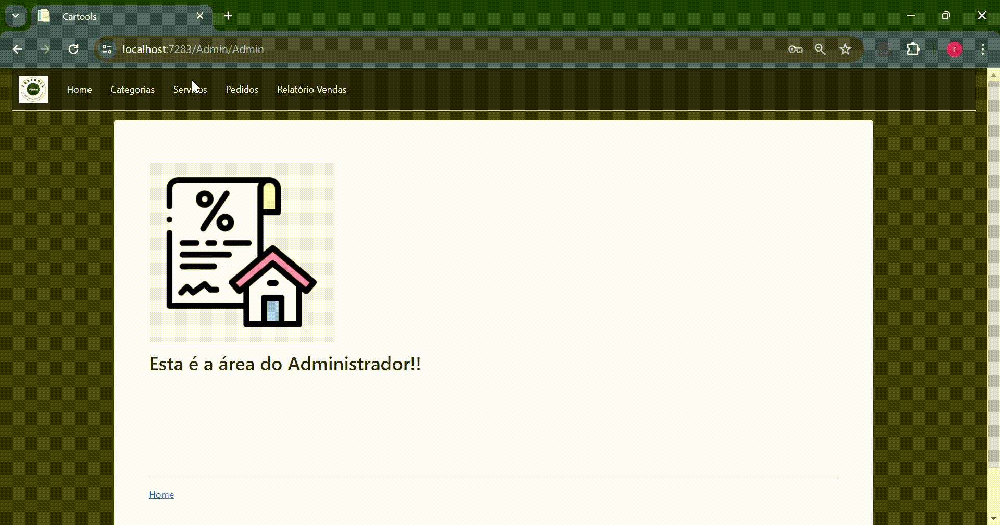

# CarTools
>Plataforma de anúncios de serviços de estética automotiva

  

O projeto consiste na criação de um sistema de anúncios de serviços de estética automotiva, em resposta à necessidade de oferecer praticidade e     otimização para os usuários que buscam serviços desse nicho. A plataforma CarTools proporcionará benefícios significativos tanto para as empresas que prestam estes serviços, quanto para os consumidores que buscam empresas desse ramo.

A plataforma permitirá que as empresas apresentem os seus serviços de forma detalhada e atraente. Cada empresa terá seu perfil personalizado, no qual poderá atualizar as informações exibidas. Os clientes, por sua vez, terão acesso a essas informações de maneira intuitiva e poderão buscar e agendar serviços com facilidade. 

### Preview - Simulação de navegação de Clientes 🚘🧍‍♂️

  

### Preview - Simulação de navegação de Usuários Parceiros 🏬👨‍🔧

  

### Preview - Simulação de navegação do Administrador do Sistema 🏬👨‍🔧

  

## Arquitetura do Sistema 🏛️
- MVC

  
## IDE 🏗️
- Visual Studio 2022

## Banco de Dados 🏦🎲
- Microsoft SQL Server 2019

## Frameworks e Bibliotecas 🛠

- ASP .NET Core
- Entity Framework Core
- BootStrap

## Linguagens 🛠

- CSharp
- JavaScript
- HTML
- CSS

## Passos para iniciar a Aplicação 🛫
- [x] Baixe em sua máquina o Microsoft Visual Studio 2022
- [x] Baixe em sua máquina o Microsoft SQL Server 2019
- [x] Abra o Microsoft Visual Studio 2022
- [x] Em "Get Started", clique na opção "Clone a repository"
- [x] Após isso, vai pedir o local que o repositório está ("Repository location")
- [x] Então cole o link do repositório remoto: https://github.com/JoseiltonUSCS/Cartools24.git 
- [x] E por fim é só clicar no botão "Clonar" para concluir, e o projeto estará em sua máquina

## Layout (Figma) 🖌️

>Você pode visualizar o layout do projeto através do link abaixo:

- [Layout](https://www.figma.com/design/U62wmxOMy3z8U2Tt03GbRC/CarTools-Web_fluxo?node-id=0-1&t=mUnPXOJI6CcpGpdg-0)

> Lembrando que você precisa ter uma conta no [Figma](http://figma.com/).

## Contribuintes 👨🏽‍🎓

- <a target="_blank" href="*">Alan Leal</a>
- <a target="_blank" href="https://github.com/JoseiltonUSCS">Joseilton Ferreira</a>
- <a target="_blank" href="https://www.linkedin.com/in/ramon-barreto-076191180/">Ramon Barreto</a>
- <a target="_blank" href="*">Stefani Bispo</a>
